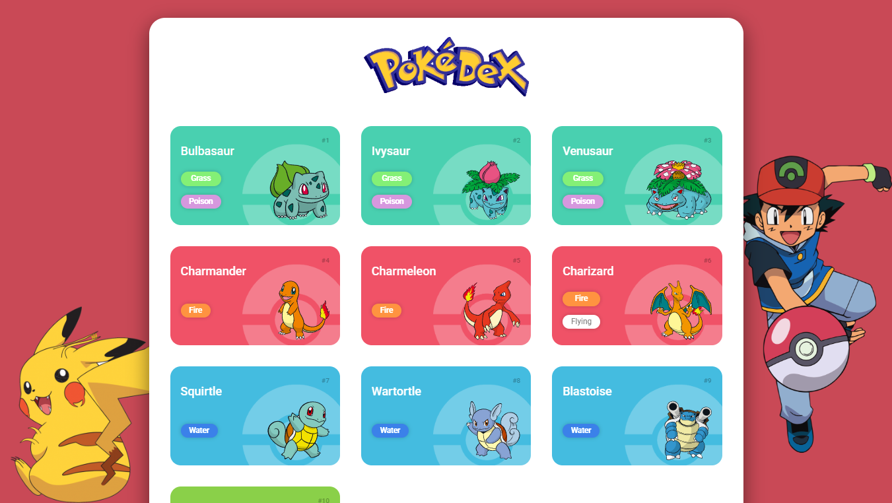

# ⚡ Pokédex Web Project

Uma Pokédex interativa desenvolvida com HTML, CSS e JavaScript, consumindo a PokéAPI para exibir informações dos Pokémon de forma dinâmica e responsiva.

A simple interactive Pokédex built with HTML, CSS, and JavaScript, using the PokéAPI to dynamically display Pokémon data in a responsive layout.

---

## 📸 Preview
<p align="center">
  
</p>

---

## 🛠️ Tecnologias utilizadas / Technologies used

- **HTML5** – estrutura semântica e acessível (semantic and accessible structure)
- **CSS3** – Flexbox, Grid Layout, responsividade e animações (Flexbox, Grid, responsiveness and animations)
- **JavaScript (ES6+)** – manipulação do DOM e Fetch API (DOM manipulation and Fetch API)
- **REST API** – consumo de dados externos com PokéAPI (external data consumption using PokéAPI)
- **Git & GitHub** – controle de versão e deploy de repositório (version control and repository deployment)
- **Responsive Design** – abordagem mobile-first (mobile-first approach)
- **UI/UX Design** – foco na experiência do usuário (user experience focus)
- **Clean Code** – organização e separação de responsabilidades (code organization and separation of concerns)
- **PokéAPI** – https://pokeapi.co/

---

## ⚙️ Funcionalidades / Features

- 📦 Listagem de Pokémon via API
- 🔎 Sistema de busca (se tiver ou quiser adicionar)
- 🎨 Interface responsiva
- ⚡ Carregamento dinâmico de dados
- 🧠 Separação por tipos de Pokémon

---

## 📁 Estrutura do projeto / Project structure

```bash
📦 pokedex
 ┣ 📂 assets
 ┣ 📂 css
 ┣ 📂 js
 ┣ 📜 index.html
 ┗ 📜 README.md
